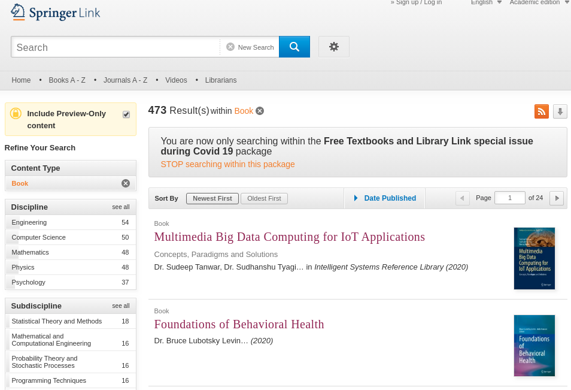
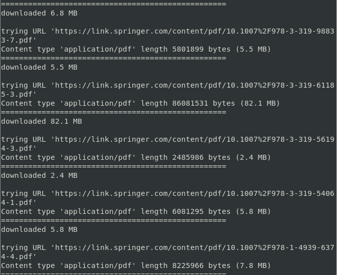
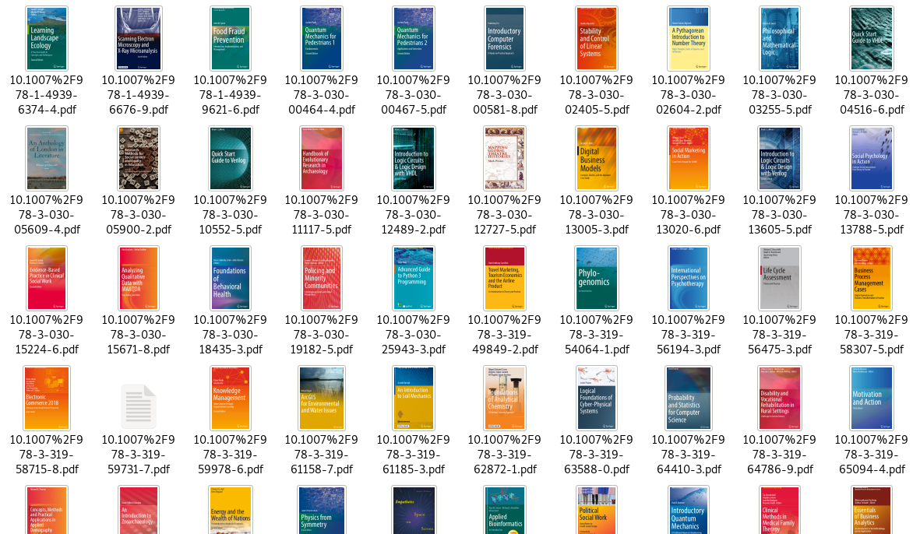

# Descargar libros gratis de link.springer.com (Disponibles hasta Julio) :books:
/play secret
1. Springer debido al Covid 19 está dejando descargar gratis ciertos libros.<br>
   **[Clic si quieres ver el sitio de descarga de los libros](https://link.springer.com/search/page/1?facet-content-type=%22Book%22&package=mat-covid19_textbooks "Dale click para sapear el sitio web")**
   
2. La librería de R que necesitamos es **rvest** así que la instalamos
   ```
   $ R
   > install.packages("rvest")
   ```
3. Para descargar los libros solo ejecuta el código R que te brindo
   ```
   $ Rscript descargar.R
   ```
   
4. Listo! podrás disfrutar de libros de diversos temas (238 libros), tales como matemática, Data Science, Computer Science, estadística, Bioinformática, etc.
   
