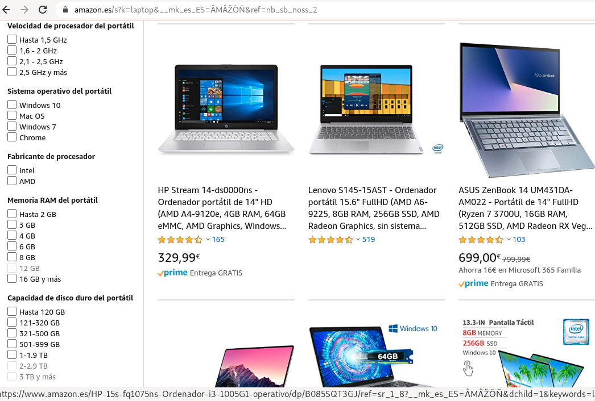
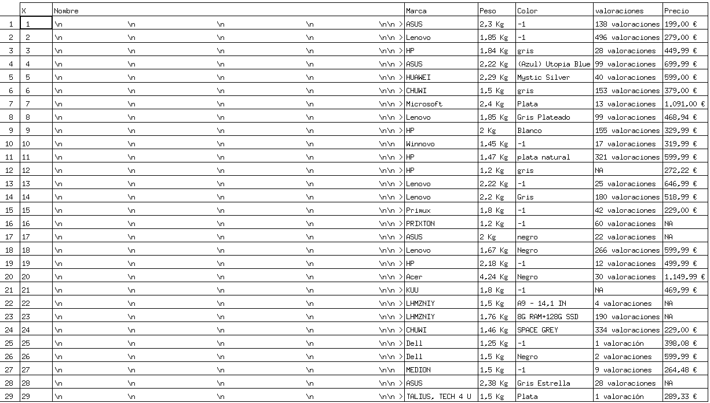
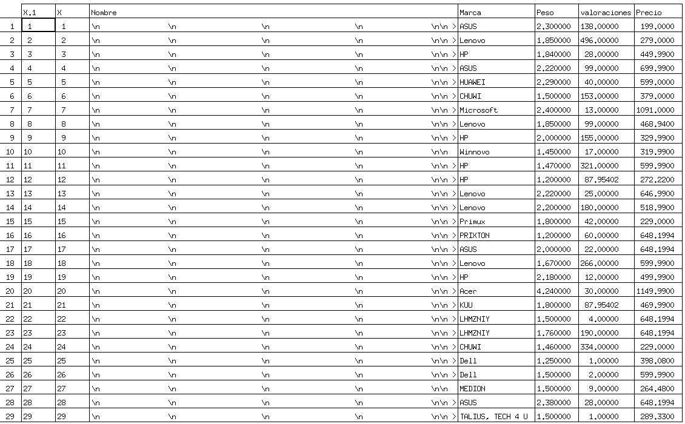
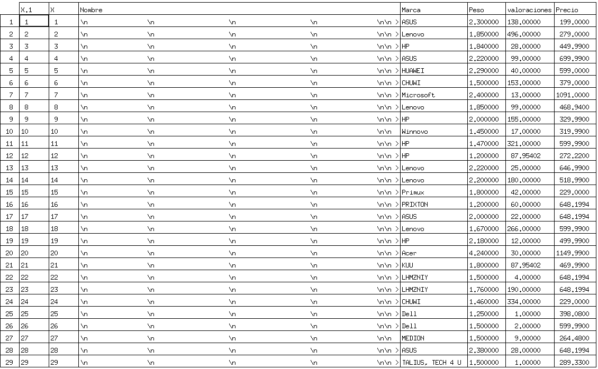
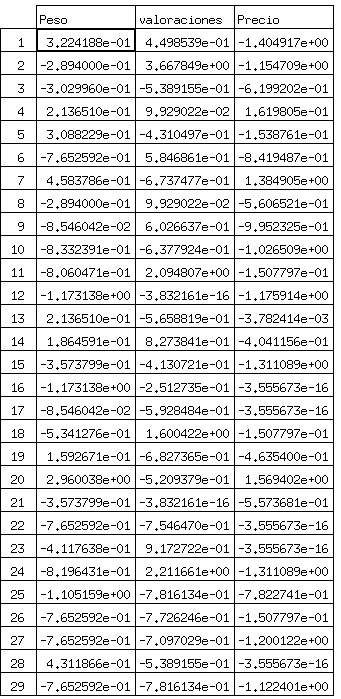
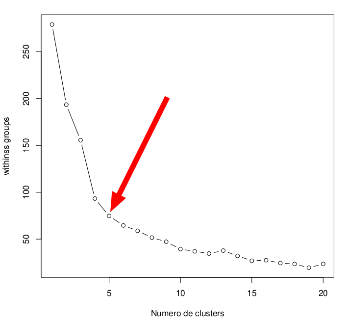
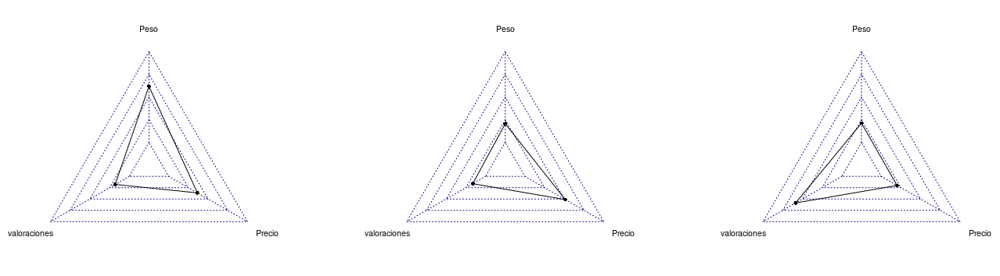

# Proceso para trabajar con Data de laptops en venta en la tienda de Amazon :computer: :moneybag: :money_with_wings:  

1. Recolección: Web Scraping   
	1. Ejecutamos el script  
		```
		$ Rscript WebScraping.R
		```
	2. Nos genera la data sin limpiar en el archivo: **data.csv**  
		
2. Limpieza de datos  
	1. Ejecutamos el script  
		```
		$ Rscript dataLimpia.R	
		```
	2. Nos genera la data limpia en el archivo: **dataLimpia.csv**  
		
3. kmeans: modelos no supervisados  
	1. Utilizaremos esta data que está limpia en la parte numérica: **dataLimpia.csv**    
		
	2. Normalizamos la data: **dataNormalizada.csv**    
		
	3. Elegimos el número óptimo de clusters usando el método Elbow   
		
	4. Calculamos los clusters  
		
