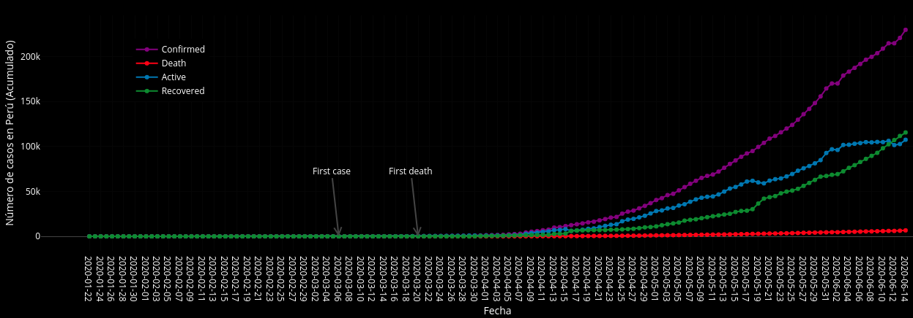
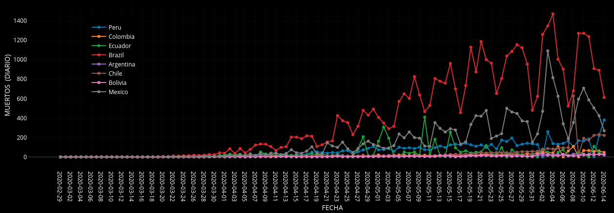
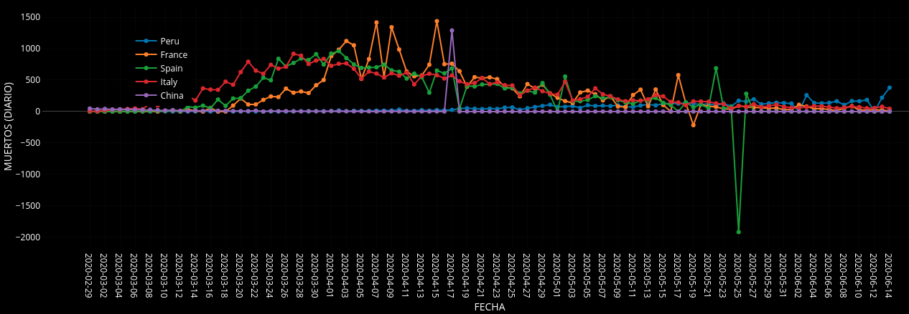

# Dashboard sobre el coronavirus  

1. Instalamos  
	```
	$ R
	> install.packages("flexdashboard")
	> install.packages("rmarkdown")
	```
2. Obtenemos el html a partir del Rmd  
	```
	$ R -e "rmarkdown::render('dashboard.Rmd')"
	```
3. Esto nos genera "dashboard.html" que podemos visualizarlo en el navegador   
	```
	$ google-chrome dashboard.html
	```
4. Veremos 3 gráficas  
	1. Número de casos en Perú (Acumulados)  
		
	2. Muertos (Diario): Perú, Colombia, Ecuador, Brazil, Argentina, Chile, Bolivia, México  
		
	3. Muertos (Diario): Perú, France, Spain, Italy, China  
		
