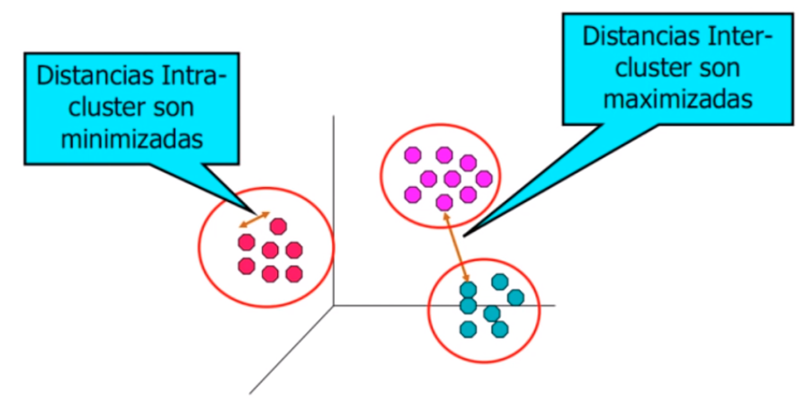
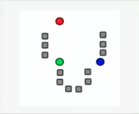
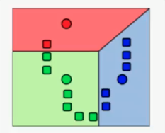
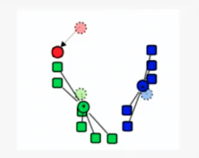
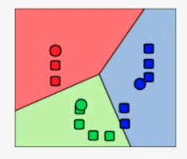
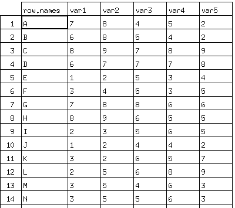
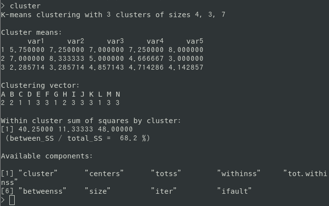
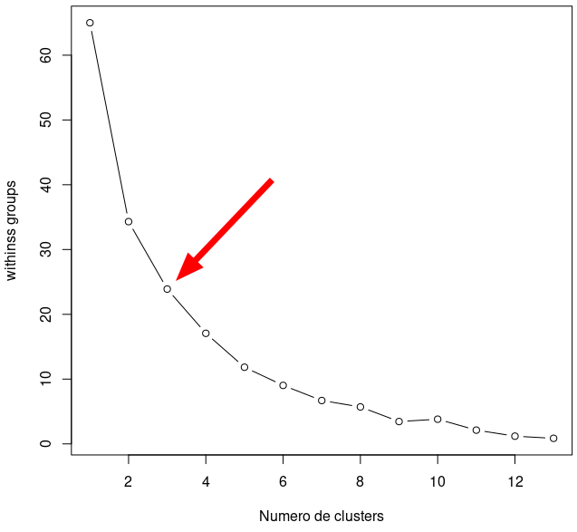
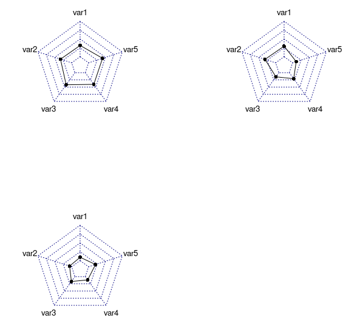

# K-Means
## Data Mining No Supervisada   
* Agrupamiento es otro ejemplo de Data Mining No Supervisada.  
* Todas las variables tienen el mismo status.  
* Todavía no hay variable dependiente.  
## Respecto a K-means  
* Este método comienza suponiendo que conocemos el número de grupos o clusters.  
* El método entonces encuentra la "mejor" asignación de puntos a los distintos grupos o clusters.  
* "Mejor" en el sentido previo de maximizar distancias inter-cluster y minimizar distancias intra-cluster.  
## Objetivo  
* K-Means es un método de agrupamiento (clustering).  
* Las técnicas de agrupamiento, en genral, tienen por objeto encontrar grupos de observaciones (clusters) con características semejantes.  
* Las observaciones de un grupo deben ser parecidas a las otras observaciones del grupo.  
* Las observaciones de un grupo deben ser lo más diferentes de las observaciones de otros grupos.  

## Pasos del algoritmo K-Means  
1. k centros iniciales, en este caso k=3, son generados aleatoriamente en un conjunto de datos.  

2. K grupos son generados, en este caso 3 grupos, asociando el dato con la media más cercana.  

3. El centro de cada uno de los k grupos se recalcula basado en la media de la partición antes asignada.  

4. Paso 2 y 3 se repiten hasta que los centros dejan de recalcularse.  

## Ventajas  
* Es rápido. Puede aplicarse a bases de datos relativamente grandes.  
* Es económico en requerimientos de almacenaje (solo necesita guardar los K centroides).  
## Desventajas  
* Supone que conocemos K (en la realidad nunca lo conocemos)  
* Es susceptible a la presencia de observaciones extremas (outliers)  
## Cuidados  
* No hay ninguna garantía de que el algoritmo encuentre la solución óptima  
* Una mala selección inicial de centroides puede resultar en un pobre agrupamiento  
* Recomendación: Recomenzar el algoritmo varias veces desde puntos diferentes. Quedarse con la mejor solución  
* K-Means, y cualquier otro algoritmo que se calcule basado en distancias, puede ser afectado por las unidades en que las variables se miden  
* Variables medidas en las unidades mas grandes dominaran la construcción de los clusters  
* Recomendación: Estandarizar las variables antes de iniciar la búsqueda de clusters  
## K-Means en R  
1. Importamos la data  
	```
	data<-read.csv("data.csv")
	rownames(data)<-c("A","B","C","D","E","F","G","H","I","J","K","L","M","N")
	```
	  
2. Obtener el cluster  
	```
	cluster <- kmeans(data,3,nstart=15,iter.max=30)
	```
	
3. Elbow: determinar el número de clusters  
	```
	a<-scale(data)
	cluster<-kmeans(a,3,nstart=5,iter.max=30)
	wss<-(nrow(a)-1)*sum(apply(a,2,var))
	for(i in 2:13) wss[i]<-sum(kmeans(a,centers=i)$withinss)
	plot(1:13,wss,type="b",xlab="Numero de clusters",ylab="withinss groups")
	```
	
4. Gráfica radar  
	```
	cluster<-kmeans(a,3,nstart=5,iter.max=30)#elbow=3 en mi caso
	library(fmsb)
	par(mfrow=c(2,2)) #2 filas de 2 graficas
	plotCentros<-function(centro){
		dat<-as.data.frame(t(cluster$centers[centro,]))
		dat<-rbind(rep(5,10),rep(-1.5,10),dat)
		radarchart(dat)
	}
	sapply(c(1:3),plotCentros)
	```
	
