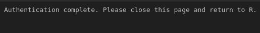

# Rtweet
## Links
> https://cran.r-project.org/web/packages/rtweet/rtweet.pdf  
> https://www.rdocumentation.org/packages/rtweet/versions/0.4.0  


## Instalación
1. librerías
	```
	> install.packages("rtweet")
	> install.packages("httpuv")
	> install.packages("readr")
	```
2. configuración
	1. tener cuenta de twitter
	2. tener instalado rtweet y httpuv
	3. autorización se realiza la primera vez que se ejecuta search_tweets,get_time_line,get_followers,etc
	4. solo para algunas aplicaciones avanzadas se requiere una app en twitter  
	
	
## ventajas y desventajas
1. ventajas
	1. api de twitter es abierta
	2. convencion de uso de #
	3. longitud limitada del texto
2. desventajas
	1. Límites en el numero de tweets(para el api standar)
		1. últimos 7 dias
		2. máximo 18000
	2. Información geográfica deficiente
3. Funciones y componentes
	1. funciones
		```
		search_tweets()		: busqueda
		stream_tweets()		: consulta en vivo
  		get_timeline()		: lineas de tiempo
  		get_followers()		: obtenga seguidores
  		get_friends()		: obtenga amigos
  		get_favorites()		: obtenga favoritos
  		get_trends()		: obtenga tendencias
  		get_users()		: buscar usuarios
		```
	2. componentes
		```
		user_id
		screen_name
		status_id
		created_at
		text
		lang
		favorite_count
		tweet_count
		is_retweet
		geo_cords
		hashtags
		mentions_user_id
		```
4. Ejemplos
	1. Consulta: Obtener tweets en los últimos 30 segundos
		1. Sin indicar palabra
			```r
			library(rtweet)
			tweets_vivo <- stream_tweets("")
			View(tweets_vivo)
			```
			
		2. Indicando palabra
			```
			library(rtweet)
			tweets_vivo <- stream_tweets("minsa")
			View(tweets_vivo)
			```
			
			
			
			
			
			
			
			
			
			
			
			
			
			
	2. Consulta: Obtener hasta la cantidad de tweets que le indiquemos (5) y guardarlo en un archivo .rds
		```r
		library(rtweet)
		library(readr)
		a <- search_tweets2("#minsa",n=1000)
		write_rds(a,path=file.path(".",paste0(Sys.Date(),"_data.rds")))
		View(a)
		```
		
	3. Recopilación: obtenemos tweets sin repetir juntando esos .rds
		```r
		library(here)
		library(dplyr)
  		library(purrr)
		library(readr)
  		#funcion para leet y compilar archivos
  		b <- function(RDS_file,patron_div_fecha,RDS_dir){
			RDS_filename<-gsub(RDS_file,pattern=paste0(RDS_dir,"."),replacement="")
			RDS_fecha <-gsub(RDS_filename,pattern=patron_div_fecha,replacement="")
			readRDS(RDS_file) %>% mutate(harvest_date=as.Date(RDS_fecha))
  		}
  		#Obtenga la lista de archivos a compilar
  		RDS_file_midata<-grep(list.files(here("."),full.names=TRUE),pattern="data",value=TRUE)
  		#patron del nombre
  		patron_div_fecha_midata<- "_data.rds"
  		#directorio
  		RDS_dir_name_midata<- here(".")
  		#Aplicamos la funcion para unir todos los datos y quedarse con los registros unicos
  		todas_data<-pmap_df(list(RDS_file_midata,patron_div_fecha_midata,RDS_dir_name_midata),b)
  		todas_data_unica<-todas_data %>% arrange(desc(harvest_date)) %>% distinct(status_id,.keep_all=TRUE)
  		write_rds(todas_data_unica,"todas_data_unica.rds")
		```
		
	4. Base de datos: Número de tweets, días twiteados, promedio de tweets por día
		```r
		library(dplyr)
		library(readr)
		todas_data_unica<-read_rds("data.rds") #Tienes que tener ya esta esta
		vieja<-todas_data_unica %>% arrange(desc(created_at)) %>% slice(n()) %>% pull(created_at)
		nueva<-todas_data_unica %>% arrange(desc(created_at)) %>% slice(1L) %>% pull(created_at)
		#Cuantos tweets hay en la base de datos
		ntweets<-nrow(todas_data_unica)
		#Cuantos dias hay en el registro
		ndias<-as.numeric(nueva-vieja)
		#Numero promedio de tweets por dia
		statusPorDia<-nrow(todas_data_unica)/ndias
		```
		
	5. Usuarios diferentes totales y tweets originales
		```r
		library(dplyr)
  		library(readr)
  		todas_data_unica<-read_rds("data.rds")
  		total_usuarios<-todas_data_unica %>% pull(screen_name) %>% unique() %>% length()
  		total_tweet_number<-todas_data_unica %>% filter(!is_retweet) %>% pull(status_id) %>% unique() %>% length()
		```
		
	6. dinámica temporal
		```r
		library(dplyr)
		library(readr)
		library(ggplot2)
		library(lubridate)
		library(xaringanthemer)
		style_mono_light(base_color = "#23395b")
		todas_data_unica<-read_rds("data.rds")
		todas_data_unica<-todas_data_unica %>% mutate(created_at=as_datetime(created_at))
		ggplot(todas_data_unica,aes(x=created_at))+geom_histogram(position="identity",bins=20,show.legend=FALSE)+labs(x="Fecha",y="Numero de tweets")+theme_xaringan()
		```
		
	7. En que días hay más actividad
		```r
		library(readr)
  		library(knitr)
  		todas_data_unica<-read_rds("data.rds")
  		dias<-table(weekdays(todas_data_unica$created_at))
  		kable(sort(dias,decreasing=TRUE),col.names=c("Dia","Frecuencia"))
		```
		
	8. top tweets
		```r
  		library(readr)
  		library(dplyr)
  		todas_data_unica<-read_rds("data.rds")
  		top_contributors<-todas_data_unica %>% filter(!is_retweet) %>% count(screen_name) %>% arrange(desc(n)) %>% top_n(10)
		```
		
	9. top retweets
		```r
  		library(readr)
  		library(dplyr)
  		todas_data_unica<-read_rds("data.rds")
  		top_contributors_retweet<-todas_data_unica %>% filter(is_retweet) %>% count(screen_name) %>% arrange(desc(n)) %>% top_n(10)
		```
		
	10. tweets mas populares
		```r
  		library(readr)
  		library(dplyr)
  		library(gt)
  		todas_data_unica<-read_rds("data.rds")
  		mas_retweeted<-todas_data_unica %>% filter(is_retweet==FALSE) %>% arrange(desc(retweet_count))
  		mas_retweeted %>% select(status_id,created_at,screen_name,retweet_count,favorite_count) %>% head(5) %>% gt()
		```
		  

		> https://twitter.com/PBODigital/status/1284990794831671296  
		> https://twitter.com/PBODigital/status/1285679433815392256  
		> https://twitter.com/PBODigital/status/1285973231183241217  
		> https://twitter.com/PBODigital/status/1286297574153039877  
		> https://twitter.com/PBODigital/status/1285729554917740546  
