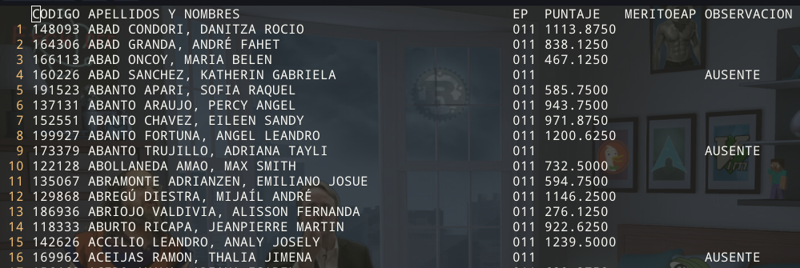

# [Resultados Admisión UNMSM](https://admision.unmsm.edu.pe/simple/Resultados0402/A.html)

## Resultados del examen de admisión de la UNMSM de una carrera específica (Medicina)

* `codigo.R`

	```r
	library(rvest)
	library(stringr)
	url<-"https://admision.unmsm.edu.pe/simple/Resultados0402/A/011/0.html"
	dameTablas<-function(url){
		schedule <- url %>% read_html %>%  html_node('body > div > div > div > div > table') %>% html_table()
		schedule
	}
	carrera<-function(url){
	x<- url %>% read_html %>%  html_node('body > div > div > div > div > table > tfoot > tr > td') %>% html_text()
	paginafinal<-substr(x, nchar(x)-3+1, nchar(x))
	paginafinal<-str_replace_all(paginafinal," ","")
	paginafinal<-as.integer(paginafinal)
	for (i in 0:paginafinal){
		pag<-paste0(substr(url,1,nchar(url)-6),i,".html")
		print(pag)
		tabla<-dameTablas(pag)
		n<-dim(tabla)[1]
		tabla<-tabla[1:(n-1),]
		colnames(tabla)[6]<-"OBSERVACION"
		if(i==0){
		write.table(tabla, file = "archivo.csv", sep = ",", append = FALSE, quote = TRUE,col.names = TRUE, row.names = FALSE)
		}else{
		write.table(tabla, file = "archivo.csv", sep = ",", append = TRUE, quote = TRUE,col.names = FALSE, row.names = FALSE)
		}
	}
	}
	ingresantesCarrera<-carrera(url)
	```

* `$ Rscript codigo.R`

* `$ csvtool readable archivo.csv | view -`

	
