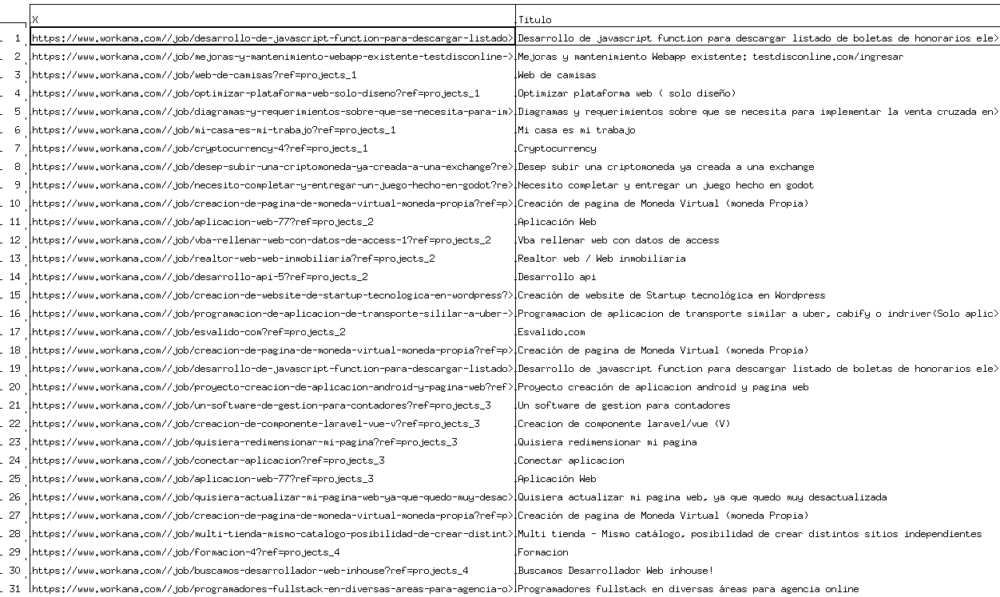

# rvest: scrapear web pages
## Instalacion:
1. Dependencias
	```
	$ sudo apt install libcurl4-openssl-dev
	$ sudo apt install libgdal-dev
	$ sudo apt install libssl-dev
	$ sudo apt install libssl-doc
	```
2. Ya podemos instalarla sin problemas
	1. verificar que este desactivado conda
		```
		$ which xml2-config
		$ conda deactivate
		```
	2. instalamos
		```
		$ R
		> install.packages("rvest")
		```
## Hashtag: partidos de la liga
1. `codigo`  

	```r
	library(rvest)
	library(rjson)
	clubs_list_url <- 'https://www.laliga.es'
	clubs_list_page <- read_html(clubs_list_url)
	json_data <- html_node(clubs_list_page, '#__NEXT_DATA__')
	json_data_value <- html_text(json_data)
	teams_data <- fromJSON(json_data_value)
	a=c()
	for (i in 1:10){
		a=c(a,teams_data$props$pageProps$layout$containers[[1]]$modules[[2]]$content[[i]]$hashtag)
	}
	b<-paste0("https://twitter.com/search?q=%23",a)
	b
	```
2. output  
	

## Obtener datos de los trabajos disponibles en Workana respecto a un item específico
1. `codigo.R`
	```r
	library(rvest)
	paginas<-paste0("https://www.workana.com/jobs?language=es&skills=javascript&page=",c(1:5))
	linksPagina<-function(url){
	#url<-"https://www.workana.com/jobs?language=es&skills=javascript&page=1"
	pagina<-read_html(url)
	selector <- "div.project-header > h2 > a"
	nodo<-html_nodes(pagina,selector)
	links<-html_attr(nodo,"href")
	links<- paste0("https://www.workana.com/",links)
	}
	datosTrabajo<-function(url){
	#library(rvest)
	#url<-"https://www.workana.com//job/programadores-fullstack-en-diversas-areas-para-agencia-online?ref=projects_1" 
	pagina<-read_html(url)
	#titulo
	titulo<-"#productName > h1"
	titulo_nodo<-html_node(pagina,titulo)
	titulo_texto<-html_text(titulo_nodo)
	#publicado
	publicado<-"#productName > p"
	publicado_nodo<-html_node(pagina,publicado)
	publicado_texto<-html_text(publicado_nodo)
	#presupuesto
	presupuesto<-"#app > div > div.container.main > section > section.box-common.block-project > div > section > article > div.row > div:nth-child(2) > h4"
	presupuesto_nodo<-html_node(pagina,presupuesto)
	presupuesto_texto<-html_text(presupuesto_nodo)
	#categoria
	categoria<-"#app > div > div.container.main > section > section.box-common.block-project > div > section > article > p.resume > strong:nth-child(1)"
	categoria_nodo<-html_node(pagina,categoria)
	categoria_texto<-html_text(categoria_nodo)
	#subcategoria
	subcategoria<-"#app > div > div.container.main > section > section.box-common.block-project > div > section > article > p.resume > strong:nth-child(3)"
	subcategoria_nodo<-html_node(pagina,subcategoria)
	subcategoria_texto<-html_text(subcategoria_nodo)
	#habilidades
	habilidades<-"#app > div > div.container.main > section > section.box-common.block-project > div > section > article > p.skills"
	habilidades_nodo<-html_node(pagina,habilidades)
	habilidades_texto<-html_text(habilidades_nodo)
	producto<-c(titulo_texto,publicado_texto,presupuesto_texto,categoria_texto,subcategoria_texto,habilidades_texto)
	producto
	}
	links<-sapply(paginas,linksPagina)
	a<-as.vector(unlist(links))
	datos<-sapply(a,datosTrabajo)
	names(datos)<-NULL
	b<-t(datos)
	b<-data.frame(b)
	colnames(b)<-c("Titulo","Publicado","Presupuesto","Categoria","Subcategoria","Habilidades")
	#rownames(b)<-NULL
	b$Titulo<-gsub('[\n]',"",b$Titulo)
	b$Titulo<-gsub('                ',"",b$Titulo)
	b$Titulo<-gsub('            ',"",b$Titulo)
	b$Publicado<-gsub('[\n]',"",b$Publicado)
	b$Publicado<-gsub('                ',"",b$Publicado)
	b$Publicado<-gsub('            ',"",b$Publicado)
	b$Presupuesto<-gsub('[\n]',"",b$Presupuesto)
	b$Presupuesto<-gsub('                                    ',"",b$Presupuesto)
	b$Presupuesto<-gsub('                                ',"",b$Presupuesto)
	b$Habilidades<-gsub('[\n]',"",b$Habilidades)
	b$Habilidades<-gsub('                            ',"",b$Habilidades)
	b$Habilidades<-gsub('                        ',"",b$Habilidades)
	write.csv(b,"workana.csv")
	```
2. output: `workana.csv` (buscando trabajos relacionados con javascript)  
	
