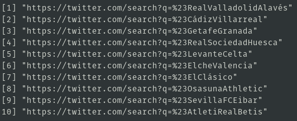

# rvest: scrapear web pages
## Instalacion:
1. Dependencias
	```
	$ sudo apt install libcurl4-openssl-dev
	$ sudo apt install libgdal-dev
	$ sudo apt install libssl-dev
	$ sudo apt install libssl-doc
	```
2. Ya podemos instalarla sin problemas
	1. verificar que este desactivado conda
		```
		$ which xml2-config
		$ conda deactivate
		```
	2. instalamos
		```
		$ R
		> install.packages("rvest")
		```
## Hashtag: partidos de la liga
1. `codigo`
	```r
	library(rvest)
	library(rjson)
	clubs_list_url <- 'https://www.laliga.es'
	clubs_list_page <- read_html(clubs_list_url)
	json_data <- html_node(clubs_list_page, '#__NEXT_DATA__')
	json_data_value <- html_text(json_data)
	teams_data <- fromJSON(json_data_value)
	a=c()
	for (i in 1:10){
		a=c(a,teams_data$props$pageProps$layout$containers[[1]]$modules[[2]]$content[[i]]$hashtag)
	}
	b<-paste0("https://twitter.com/search?q=%23",a)
	b
	```
2. output  
	
